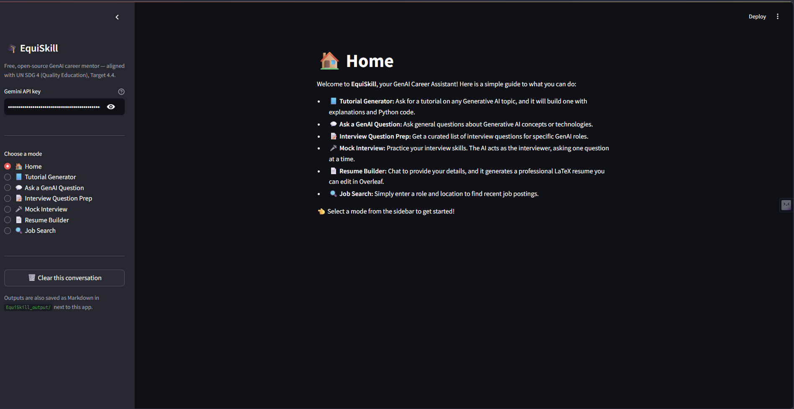
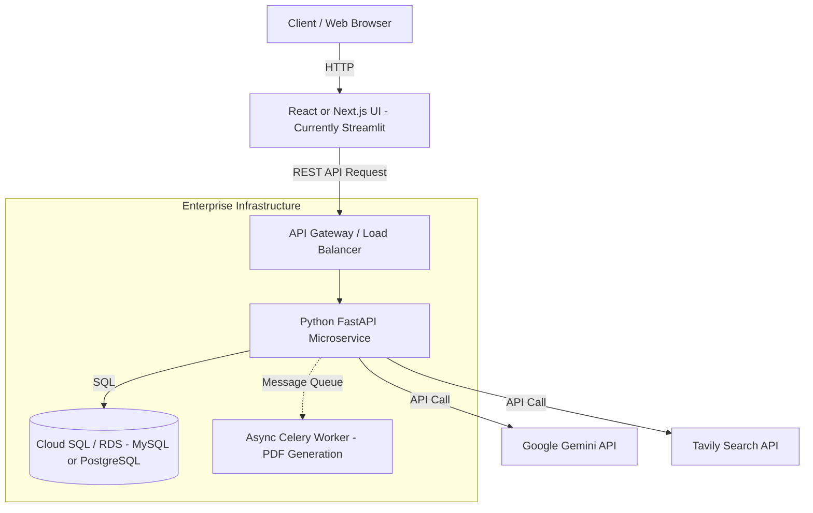

# EquiSkill — GenAI Career Assistant

[](LICENSE)

## 📁 Documentation

All project documentation for the internship submission is in the [`/docs`](docs/) folder:

| Document | File |
|---|---|
| 📋 Concept Note | [Concept Note.pdf](docs/Concept%20Note.pdf) |
| 📊 Pitch Deck (PPT) | [EquiSkill_pitch_deck.pptx](docs/EquiSkill_pitch_deck.pptx) |
| � Pitch Deck (PDF) | [EquiSkill_pitch_deck.pdf](docs/EquiSkill_pitch_deck.pdf) |
| �🗂️ Lean Canvas | [equiskill_lean_canvas.pdf](docs/equiskill_lean_canvas.pdf) |

---

A free, open-source, multi-agent Streamlit app that helps people learn Generative AI,
prepare for interviews, build a resume, and find jobs — powered by Gemini + LangChain.

**Aligned with UN SDG 4 (Quality Education), Target 4.4** — increasing the number of
people with relevant skills for employment in emerging technology fields, using a
free tool rather than a paid bootcamp or mentorship program.

## Features

| Mode | What it does |
|---|---|
| 📘 Tutorial Generator | Writes a GenAI tutorial with code, using live Tavily web search for up-to-date info |
| 💬 Ask a GenAI Question | Open Q&A chat with an "expert GenAI engineer" persona |
| 📝 Interview Question Prep | Curated interview questions with web-sourced references |
| 🎤 Mock Interview | Upload your resume — AI interviews you based on your actual experience |
| 📄 Resume Builder | Conversational builder that generates a professional LaTeX resume for Overleaf |
| 🔍 Job Search | One-shot search + clean Markdown summary of listings |

## Screenshots & Demo

> **Tip for judges:** Clone the repo and run `docker-compose up --build -d` — the full stack (UI + API + DB) is up in one command.

### Home


### Modes in Action

| Tutorial Generator | Ask a GenAI Question |
|---|---|
|  |  |

| Interview Question Prep | Mock Interview |
|---|---|
|  |  |

| Resume Builder | Job Search |
|---|---|
|  |  |

> 📄 Resume Builder also exports a LaTeX PDF via Overleaf — see [`Resume Builder- Latex.png`](docs/screenshots/Resume%20Builder-%20Latex.png)

## Project structure

```
equiskill/
├── app.py                   # Original monolithic Streamlit app (for local dev)
├── app_frontend.py          # ★ Decoupled Streamlit frontend (calls FastAPI via REST)
├── backend_main.py          # ★ FastAPI REST backend (LangChain / Gemini logic lives here)
├── docker-compose.yml       # ★ Orchestrates MySQL + Backend + Frontend
├── Dockerfile.backend       # ★ FastAPI image (multi-stage)
├── Dockerfile.frontend      # ★ Streamlit image (lightweight)
├── requirements.txt             # Full (local dev)
├── requirements-backend.txt     # Backend only
├── requirements-frontend.txt    # Frontend only
├── .env.example             # copy to .env and add your keys
└── src/
    ├── config.py            # Gemini FallbackLLM setup (auto-rotates 5 models)
    ├── agents.py            # LearningResourceAgent, InterviewAgent, ResumeMaker, JobSearch
    ├── database.py          # ★ SQLAlchemy models (ChatSession, GeneratedResume) + MySQL
    ├── latex_resume.py      # LaTeX resume generator (Jake's Resume template)
    └── utils.py             # File parsing, chat trimming
```

★ = added in enterprise architecture upgrade

## Docker Quickstart (Enterprise Mode)

**Prerequisites:** [Docker Desktop](https://www.docker.com/products/docker-desktop/)

```bash
# 1. Clone and configure
git clone https://github.com/pawarharish2801-netizen/EquiSkill.git
cd EquiSkill
cp .env.example .env
# Edit .env — set GOOGLE_API_KEY and TAVILY_API_KEY

# 2. Launch everything with one command
docker-compose up --build -d

# 3. Open the app
# Streamlit UI → http://localhost:8501
# FastAPI docs  → http://localhost:8000/docs   (interactive API explorer!)
```

To stop: `docker-compose down` (add `-v` to also delete the database volume).


## Setup

### Windows (easiest way)

1. Install **Python 3.11 or 3.12** from https://www.python.org/downloads/release/python-3119/
   — during install, tick **"Add python.exe to PATH"** and (if offered) **"Install for all
   users" / py launcher**. **Avoid Python 3.13+ for now** — several pinned packages here
   (numpy, streamlit) don't yet ship prebuilt Windows wheels for the newest Python
   releases, which forces pip to compile from source and fail without a C compiler.
2. Get a free Gemini API key: https://aistudio.google.com/app/apikey
3. Double-click **`setup_windows.bat`**. It auto-detects a compatible Python (3.9-3.12,
   preferring 3.12), creates a virtual environment, installs everything, and opens
   Notepad so you can paste your API key into `.env`. If it can't find a compatible
   Python, it'll tell you exactly what to install.
4. Double-click **`start_app.bat`** to launch the app. Your browser opens automatically
   at `http://localhost:8501`.

If double-clicking does nothing visible, right-click the `.bat` file → **Run as administrator**,
or open Command Prompt in this folder and run `setup_windows.bat` / `start_app.bat` manually.

<details>
<summary>Manual Windows setup (Command Prompt / PowerShell)</summary>

```bat
python -m venv .venv
.venv\Scripts\python.exe -m pip install -r requirements.txt
copy .env.example .env
notepad .env
.venv\Scripts\python.exe -m streamlit run app.py
```

Note the `.venv\Scripts\python.exe -m streamlit` form instead of a bare `streamlit run` —
this works even if `.venv\Scripts` isn't properly on your PATH, which is the most common
cause of a `'streamlit' is not recognized` error on Windows.

PowerShell users: if `.venv\Scripts\activate` is blocked by execution policy, run once:
```powershell
Set-ExecutionPolicy -Scope Process -ExecutionPolicy Bypass
```
</details>

### macOS / Linux

```bash
python3 -m venv .venv
source .venv/bin/activate
pip install -r requirements.txt
cp .env.example .env      # then paste your Gemini API key in
streamlit run app.py
```

### Either OS

You can also skip the `.env` file entirely and paste your API key straight into the
sidebar text box when the app opens — it's only kept in memory for that session, not saved.


## Notes & possible next steps

- **Model fallback chain** — `src/config.py` runs a 5-model auto-rotating `FallbackLLM`.
  When any model hits its free-tier rate limit (429 / ResourceExhausted), the app
  transparently retries with the next model in the chain, so the user rarely sees an
  error. The current chains are:
  - *Pro chain* (content generation): `gemini-2.5-flash` → `gemini-3-flash` → `gemini-3.5-flash` → `gemini-2.5-flash-lite` → `gemini-3.1-flash-lite`
  - *Flash chain* (routing/categorization): same models, highest-RPD first
  If Google retires one of these models you'll get a `404` — remove it from
  `PRO_MODELS` / `FLASH_MODELS` in `src/config.py` and add the current stable name
  from https://ai.google.dev/gemini-api/docs/models.
- **SDK deprecation warning** — `langchain-google-genai==2.0.4` still depends on the
  deprecated `google.generativeai` SDK (you'll see a `FutureWarning` on startup).
  Upgrading to `langchain-google-genai` 4.x + `google-genai` would remove it, but
  that's a major-version jump that could change other behavior.
- **Web search** — uses **Tavily Search API** (1 000 free requests/month). Get a key
  at https://tavily.com and set `TAVILY_API_KEY` in your `.env` file.
- **SDG 4 stretch goal**: add a lightweight "readiness score" (self-rated before/after
  a session) and/or a regional-language toggle to widen access.

## Enterprise Architecture (Future State)

To take this application to production and support thousand of concurrent users, the monolithic script structure would be decoupled into a microservice architecture.


